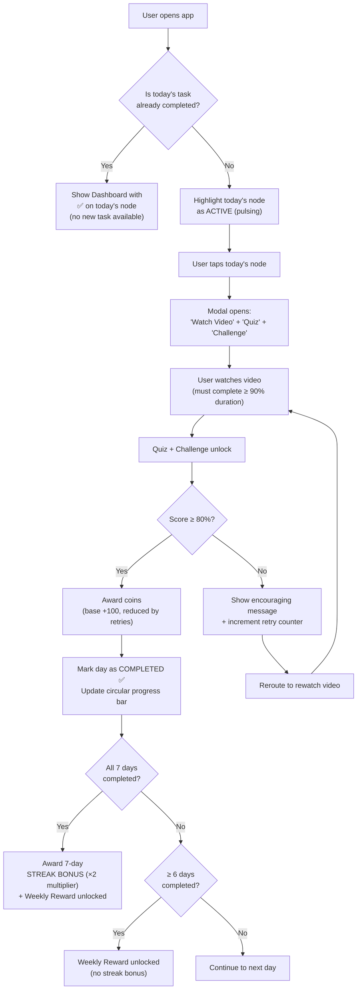

# Net Gains — Product Requirements Document (PRD)

**Version:** 1.1  
**Date:** 1 March 2026 (updated 1 March 2026)  
**Author:** Product & UX Architecture Team  
**Award Category:** Lee Hsien Loong Smart Digital Nation Award — Digital Services  

---

## 1. Executive Summary

**Net Gains** is a gamified mobile-first web application that transforms the Monetary Authority of Singapore's (MAS) MoneySense curriculum into a habit-building, reward-driven learning experience for secondary and tertiary students (ages 13–25).

The core innovation is a **weekly sprint model**: each week maps to one MoneySense financial literacy goal, broken into 7 bite-sized daily tasks. Each day includes a short video, a quiz, and one or more **practical challenges** (e.g., saving $5, creating a budgeting plan). A daily action cap prevents binge-learning and instead reinforces daily engagement — mirroring the proven cadence of apps like LumiHealth. Students earn **coins** for passing (≥ 80%), with an **immediate retry loop** on failure (rewatch → reattempt) and **diminishing coin rewards** per retry to incentivise first-attempt mastery. Completing at least 6/7 days unlocks the weekly milestone reward, and a perfect 7/7 streak earns a **×2 multiplier bonus**.

By combining linear course progression, tokenomics, and a visually engaging "roadmap" game board, Net Gains makes financial resilience, budgeting, and scam defence genuinely compelling for Gen-Z learners in Singapore.

---

## 2. User Personas

### Persona 1 — "The Casual Learner" (Secondary Student)

| Attribute | Detail |
|---|---|
| **Name** | Aisha, 15 |
| **Education** | Sec 3, neighbourhood school |
| **Tech comfort** | High — uses TikTok, Instagram daily |
| **Motivation** | Wants to save for concert tickets; curious about "adulting" |
| **Pain point** | Finds MoneySense PDFs boring; short attention span |
| **Goal** | Quick, rewarding micro-lessons she can do on the MRT |

### Persona 2 — "The Ambitious Saver" (Polytechnic / JC Student)

| Attribute | Detail |
|---|---|
| **Name** | Jun Wei, 18 |
| **Education** | Year 2 Polytechnic, Business |
| **Tech comfort** | High — uses budgeting apps casually |
| **Motivation** | Wants to avoid scams (friend fell for an MLM scheme) |
| **Pain point** | Information overload; doesn't know which resources to trust |
| **Goal** | Structured, credible curriculum with tangible progress tracking |

### Persona 3 — "The Educator / Advocate"

| Attribute | Detail |
|---|---|
| **Name** | Mr. Tan, 34 |
| **Role** | Secondary school CCE teacher |
| **Motivation** | Needs an engaging tool to supplement Character & Citizenship Education |
| **Pain point** | Existing MAS resources lack interactivity for classroom adoption |
| **Goal** | Assign Net Gains as a co-curricular resource and track class progress |

---

## 3. User Stories

### Authentication & Onboarding
| ID | Story | Priority |
|---|---|---|
| US-01 | As a new user, I want to sign in with my Gmail, Apple, or Facebook account so I can start immediately without creating a new password. | **P0** |
| US-02 | As a first-time user, I want a brief onboarding walkthrough so I understand the sprint model, daily tasks, and coin system. | **P0** |

### Dashboard (Home)
| ID | Story | Priority |
|---|---|---|
| US-03 | As a student, I want to see a prominent circular progress bar showing my weekly coin progress so I know how close I am to the weekly reward. | **P0** |
| US-04 | As a student, I want to see a 7-day roadmap so I can track which daily tasks I've completed and which remain. | **P0** |
| US-05 | As a student, I want to tap a day node to view its requirements (video + quiz + challenge + 80% threshold) so I know exactly what to do. | **P0** |
| US-06 | As a returning user, I want the dashboard to reflect my real-time progress so I feel motivated to maintain my streak. | **P0** |

### Daily Task Loop
| ID | Story | Priority |
|---|---|---|
| US-07 | As a student, I want to watch a short (≤ 1 min) video lesson so I can learn a concept quickly. | **P0** |
| US-08 | As a student, I want to take a quiz after the video so I can test my understanding. | **P0** |
| US-08b | As a student, I want to complete a practical challenge (e.g., save $5, create a budgeting plan) so I apply what I learned to real life. | **P0** |
| US-09 | As a student, I want to receive immediate feedback on my quiz/challenge score and know if I passed (≥ 80%). | **P0** |
| US-09b | As a student, if I fail, I want to be rerouted to rewatch the video and retry immediately so I can learn from my mistakes without waiting. | **P0** |
| US-09c | As a student, I want to see encouraging messages when I retry so I stay motivated. | **P0** |
| US-08c | As a student, I want to write a journal entry reflecting on what I learned after completing a daily task so I can consolidate my understanding. | **P0** |
| US-08d | As a student, I want to browse all my past journal entries (tagged by lesson and day) so I can review my learning journey at any time. | **P0** |
| US-10 | As a student, I want to earn coins when I pass, understanding that retries earn fewer coins, so I'm incentivised to do my best on the first try. | **P0** |
| US-11 | As a student, I want to be prevented from doing tomorrow's task today so I build a consistent daily habit. | **P0** |

### Quests & Courses
| ID | Story | Priority |
|---|---|---|
| US-12 | As a student, I want to see the current active course prominently so I know what I'm working on this week. | **P0** |
| US-13 | As a student, I want future courses to be visually locked so I understand the linear progression path. | **P0** |
| US-14 | As a student, I want a course to unlock only after I complete the previous week's roadmap so progression feels earned. | **P0** |

### Rewards Center
| ID | Story | Priority |
|---|---|---|
| US-15 | As a student, I want to see my total coin balance so I can decide what to redeem. | **P0** |
| US-16 | As a student, I want to browse tiered rewards (vouchers, badges) so I have meaningful goals to work towards. | **P0** |
| US-17 | As a student, I want to redeem a reward and see my balance update instantly so the transaction feels trustworthy. | P1 |

---

## 4. Functional Requirements

### 4.1 Authentication & Onboarding

| Req ID | Requirement |
|---|---|
| FR-01 | The system shall support SSO via Google (Gmail), Apple Sign-In, and Facebook Login using Supabase Auth. |
| FR-02 | On first login, the system shall display a 3-screen onboarding carousel explaining: the weekly sprint model, the daily task cap, and how coins/rewards work. |
| FR-03 | The system shall create a user profile row in Supabase upon first authentication, initialising coin balance to 0 and current course to Week 1. |

---

### 4.2 Screen 1 — Main Dashboard (Home)

| Req ID | Requirement |
|---|---|
| FR-04 | The dashboard shall display a **circular progress bar** (≥ 160 px diameter) at the top/centre, filled in **Mountain Meadow (#2CC295)**, showing `coins earned this week / weekly coin goal`. |
| FR-05 | The centre of the progress ring shall display the numeric coin count and the weekly goal (e.g., "420 / 700"). |
| FR-06 | Below the progress bar, the dashboard shall render a **7-node roadmap** (horizontal scroll or winding path). Each node represents one day (Mon–Sun). |
| FR-07 | **Node states:** ✅ Completed (filled Mountain Meadow), 🔵 Current/Active (pulsing outline, Mountain Meadow), ⬜ Upcoming (Pistachio #AACBC4 outline), 🔒 Locked (greyed, not today). |
| FR-08 | Tapping a **completed or active** node shall open a modal showing: video title, quiz title, challenge title, pass/fail status, score, and coins earned. |
| FR-08b | After completing a daily task, the system shall present a **journal / reflection** text area where the user can write paragraphs about their work log and what they learned. Each entry is tagged with the lesson title, day number, and timestamp, and persisted to the user's account. A **"My Journal"** view shall allow the user to browse all past entries at any time. |
| FR-09 | Tapping a **locked** node shall show a disabled modal with the message: "This task unlocks on [Day Name]." |
| FR-10 | The dashboard shall display greeting text personalised with the user's first name and current streak count (e.g., "Hey Aisha! 🔥 3-day streak"). |

---

### 4.3 Screen 2 — Quests & Courses

| Req ID | Requirement |
|---|---|
| FR-11 | The top of the screen shall display an **active course card** (elevated, Anti-Flash White #F1F7F6 background, Stone #707D7D border) showing: course title, week number, curriculum summary (e.g., "7 × 1-min videos · 7 quizzes · 7 challenges"), and a mini progress bar (days completed / 7). |
| FR-12 | Below the active card, the screen shall render a **vertical list of future courses**, each displayed as a card in **Pistachio (#AACBC4)** with reduced opacity (0.5), a lock icon, and `pointer-events: none`. |
| FR-13 | A course shall transition from "Locked" to "Active" only when the user completes at least **6 of 7** daily tasks in the preceding course's week. |
| FR-14 | Completed courses shall display a ✅ badge, the total coins earned, and a "Review" button that allows replay of videos (no additional coins). |

---

### 4.4 Screen 3 — Rewards Center

| Req ID | Requirement |
|---|---|
| FR-15 | The top of the screen shall display the user's **total coin balance** in a prominent header bar (Rich Black #021B1A text on Anti-Flash White #F1F7F6). |
| FR-16 | Below the balance, the screen shall display a **grid (2 columns)** of reward cards. Each card shows: reward image/icon, title, coin cost, and tier badge (Bronze / Silver / Gold). |
| FR-17 | Rewards the user cannot yet afford shall display the coin cost in **Pistachio (#AACBC4)** text with a disabled state. Affordable rewards shall display the cost in **Mountain Meadow (#2CC295)** with an active "Redeem" button. |
| FR-18 | On redemption, the system shall: deduct coins from the user's balance, record the transaction in the Supabase `coin_ledger` table, and show a confirmation animation. |
| FR-19 | The Rewards Centre shall include a "My Rewards" tab listing all previously redeemed items with timestamps. |

---

### 4.5 Bottom Navigation Bar

| Req ID | Requirement |
|---|---|
| FR-20 | A persistent bottom nav bar shall be visible on all core screens with 3 tabs: **Home** (dashboard icon), **Quests** (book/flag icon), **Rewards** (gift icon). |
| FR-21 | The active tab icon shall use **Mountain Meadow (#2CC295)**; inactive tabs shall use **Pistachio (#AACBC4)**. |
| FR-22 | Tab transitions shall use a smooth crossfade animation (≤ 300 ms). |

---

## 5. Core Logic Flow — Daily Task Completion Loop



### Step-by-Step Narrative

1. **App Open** — The app checks the current day-of-week against the user's `weekly_progress` record in Supabase.
2. **Gate Check** — If today's task is already completed, the dashboard renders normally with no active task. The user cannot redo the quiz for additional coins.
3. **Task Initiation** — If the task is available, today's node pulses. Tapping it opens the task modal showing the video, quiz, practical challenge, and task.
4. **Video Consumption** — The user must watch ≥ 90% of the video's duration. A progress bar on the video player tracks this. The quiz, challenge, and task buttons remain disabled until the threshold is met.
5. **Quiz + Challenge + Task Attempt** — The quiz consists of 10 MCQ questions; the challenge is a practical task (e.g., save $5, draft a budget); the task is an additional activity (e.g., track expenses, create a savings goal). The combined score must be ≥ 80% to pass.
6. **Pass → Coin Award** — On passing, coins are credited to the user's balance via an INSERT into the `coin_ledger` table (type: `daily_task`). The coin amount depends on retry count: **1st attempt = 100 coins, 2nd = 75, 3rd = 50, 4th+ = 25**. The dashboard's circular progress bar and roadmap node update in real time.
7. **Fail → Immediate Retry** — If the user fails, the app displays an **encouraging message** (e.g., "Almost there! Let's review the video and try again") and **reroutes them to rewatch the video**, after which the quiz, challenge, and task unlock again. There is **no lockout** — the user may retry as many times as needed within the day, with diminishing coin rewards per retry.
8. **Weekly Evaluation** — At the end of the 7-day sprint:
   - **7/7 days completed:** Unlock weekly reward + apply a ×2 coin multiplier bonus on all coins earned that week.
   - **6/7 days completed:** Unlock weekly reward (no bonus).
   - **< 6 days completed:** Weekly reward is **not** unlocked. Coins earned from individual daily tasks are retained.
9. **Course Transition** — If the weekly reward is unlocked (≥ 6/7), the next course in the Quests screen transitions from Locked → Active.

---

## 6. Tokenomics Summary

| Event | Coins Awarded | Condition |
|---|---|---|
| Daily task pass — 1st attempt | +100 | Quiz + challenge score ≥ 80% |
| Daily task pass — 2nd attempt | +75 | Passed after 1 retry |
| Daily task pass — 3rd attempt | +50 | Passed after 2 retries |
| Daily task pass — 4th+ attempt | +25 | Passed after 3+ retries |
| Weekly reward (6/7 days) | Reward unlocked | ≥ 6 daily tasks completed |
| Perfect streak bonus (7/7) | ×2 multiplier on week's coins | All 7 daily tasks completed |
| Fail (pre-retry) | 0 (retry immediately) | Score < 80%; user rerouted to rewatch + retry |

---

## 7. Non-Functional Requirements

| Category | Requirement |
|---|---|
| **Performance** | Dashboard load time ≤ 1.5 s on 4G. All animations at 60 fps. |
| **Scalability** | Supabase backend must support ≥ 10,000 concurrent users (Row Level Security enabled). |
| **Accessibility** | WCAG 2.1 AA compliance. Minimum contrast ratios met for all text/background pairs. Support for system font-size scaling. |
| **Security** | All API calls over HTTPS. Supabase RLS policies ensure users can only read/write their own data. OAuth tokens stored securely (no localStorage for sensitive data). |
| **Offline Resilience** | Videos cached via Service Worker for offline viewing. Quiz submissions queued and synced when connectivity resumes. |
| **Internationalisation** | MVP in English. Architecture must support future i18n (string externalisation). |
| **Data Privacy** | PDPA (Singapore) compliant. Minimal PII collected (name, email, profile photo from OAuth). No data sold to third parties. |
| **Platform** | Mobile-first responsive PWA. Target: iOS Safari 16+, Chrome 110+ (Android), Desktop Chrome/Edge. |
| **Hosting & CI/CD** | Deployed on **Vercel** with preview deployments per branch. |

---

## 8. Design System Reference

### Primary Colours

| Token | Hex | Usage |
|---|---|---|
| **Rich Black** | `#021B1A` | Body text, headings, dark accents |
| **Dark Green** | `#032221` | Deep backgrounds, dark-mode surfaces |
| **Bangladesh Green** | `#03624C` | Secondary buttons, emphasis accents |
| **Mountain Meadow** | `#2CC295` | Primary buttons, active states, progress fills |
| **Caribbean Green** | `#00DF81` | Highlights, success states, key call-to-actions |
| **Anti-Flash White** | `#F1F7F6` | Page backgrounds, card surfaces |

### Secondary Colours

| Token | Hex | Usage |
|---|---|---|
| **Pine** | `#06302B` | Dark accents, footer backgrounds |
| **Basil** | `#0B453A` | Card borders (dark), secondary text on dark backgrounds |
| **Forest** | `#095544` | Hover states, active borders |
| **Frog** | `#17876D` | Secondary active states, link text |
| **Mint** | `#2FA98C` | Subtle highlights, tag backgrounds |
| **Stone** | `#707D7D` | Borders, dividers, muted text |
| **Pistachio** | `#AACBC4` | Secondary/inactive elements, locked states, disabled text |

**Typography:** Axiforma — body 14 px, headings 20–28 px, weights Regular / Medium / Semi Bold.  
**Corner Radius:** 16 px (cards), 12 px (buttons), 50% (avatar, progress ring).  
**Elevation:** Subtle box-shadows with a slight 3D feel (inspired by LumiHealth).  
**Icons:** Phosphor Icons (duotone style) for consistency with the soft, modern aesthetic.

---

## 9. Tech Stack & Architecture

| Layer | Technology |
|---|---|
| **Frontend** | HTML / CSS / JavaScript (via Google Antigravity + Claude Code) |
| **UI/UX Design** | Figma (Make mode for developer handoff) |
| **Backend & DB** | Supabase (PostgreSQL, Auth, Realtime, Storage) |
| **Hosting** | Vercel (edge network, preview deploys) |
| **Video Hosting** | Supabase Storage or external CDN (TBD) |

### Key Supabase Tables

```
users            (id, name, email, avatar_url, created_at)
courses          (id, title, description, week_number, order)
daily_tasks      (id, course_id, day_number, video_url, video_duration)
challenges       (id, daily_task_id, type, title, description, criteria)
quiz_questions   (id, daily_task_id, question, options[], correct_answer)
user_progress    (id, user_id, course_id, day_number, status, score, attempts, completed_at)
coin_ledger      (id, user_id, amount, type, description, created_at)
rewards          (id, title, description, image_url, cost, tier)
user_rewards     (id, user_id, reward_id, redeemed_at)
journal_entries  (id, user_id, course_id, day_number, lesson_title, body, created_at)
```

---

## 10. Success Metrics (KPIs)

| Metric | Target |
|---|---|
| Daily Active Users (DAU) | ≥ 500 within 3 months of launch |
| 7-day retention rate | ≥ 40% |
| Average weekly streak | ≥ 5.5 / 7 days |
| Quiz pass rate (first attempt) | ≥ 65% |
| Course completion rate | ≥ 50% of enrolled users |
| Reward redemption rate | ≥ 30% of earned coins redeemed |

---

## 11. Risks & Mitigations

| Risk | Impact | Mitigation |
|---|---|---|
| Students game the system (e.g., skip video, guess quiz) | Low learning efficacy | Video completion gate (≥ 90%); quiz questions change on retry |
| Daily cap frustrates power users | Drop-off | Unlock bonus content (articles, infographics) after daily task — no extra coins |
| MAS curriculum changes | Content staleness | Modular content architecture; admin CMS for easy updates |
| Low initial adoption | Failed award submission | Partner with MOE/schools for classroom integration; teacher dashboard (v2) |

---

## 12. Roadmap

| Phase | Scope | Timeline |
|---|---|---|
| **MVP (v1.0)** | Auth (Supabase SSO), Onboarding carousel, Dashboard, Quests (3 courses), Daily Task Loop (video + quiz + challenge + journal), Rewards Centre, Vercel deployment | 1 Mar – **13 Mar 2026** |
| **v1.1** | Streak notifications (push), leaderboard (class-level) | Weeks 3–4 |
| **v2.0** | Teacher/admin dashboard, additional MoneySense courses, i18n (Mandarin/Malay/Tamil) | Weeks 5–8 |

---

*This document is a living artifact. All requirements are subject to iteration based on user testing and stakeholder feedback.*